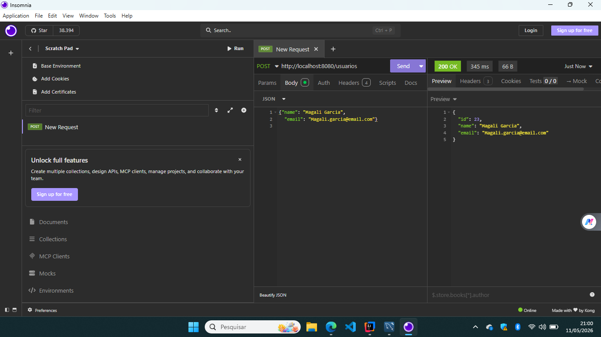
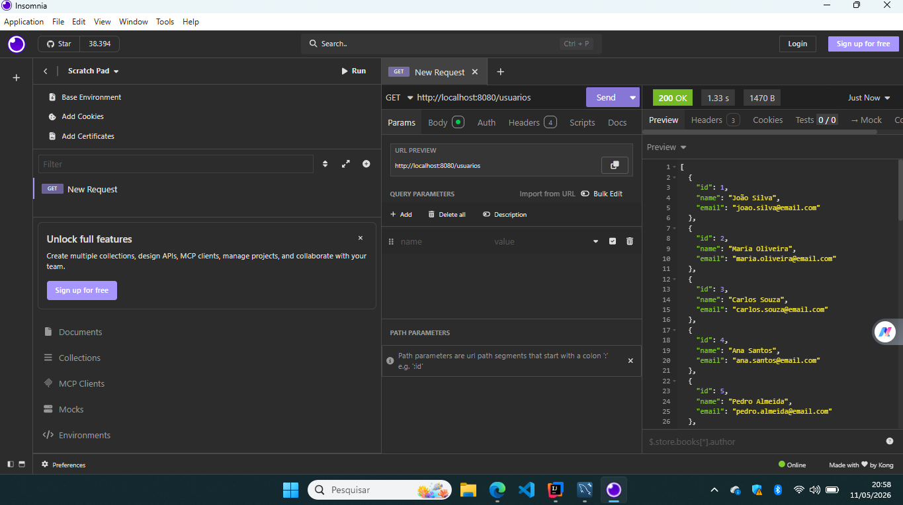
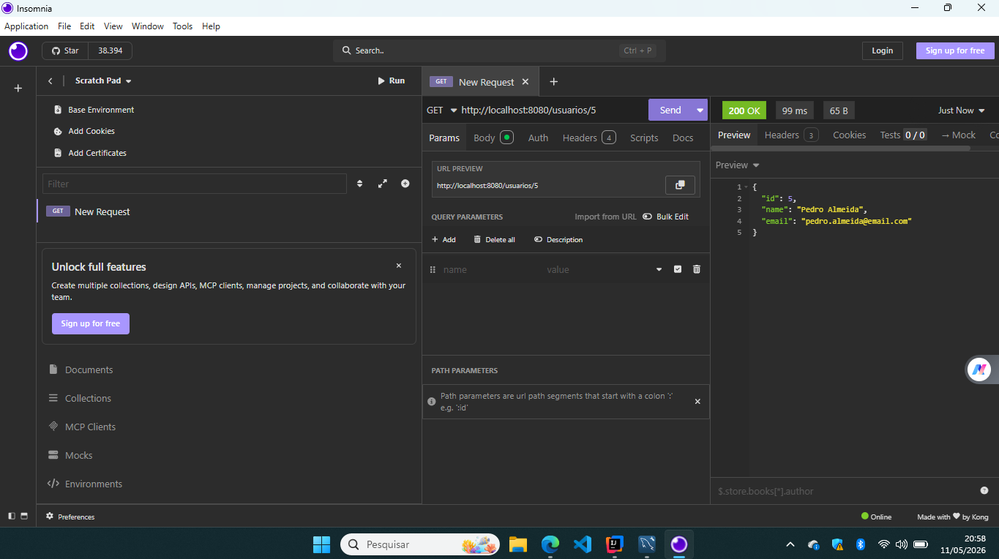
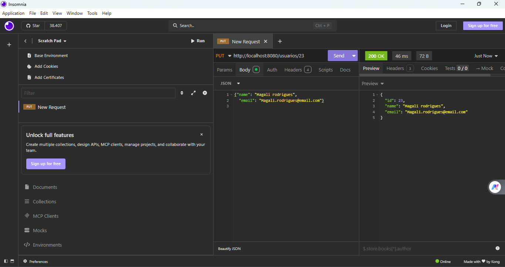
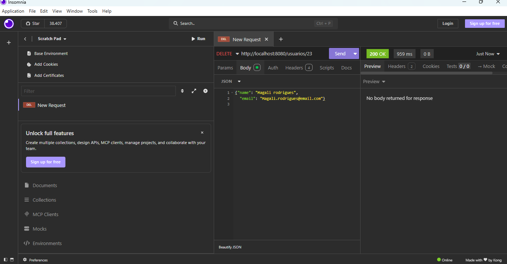

# 🚀 Projeto 1 — API REST de Usuários com Java + Spring Boot

## 📌 Sobre o Projeto

Este projeto foi desenvolvido com foco em aprendizado prático de desenvolvimento backend utilizando Java e Spring Boot.

A aplicação consiste em uma API REST simples para gerenciamento de usuários, implementando operações básicas de CRUD.

O objetivo principal do projeto foi fortalecer fundamentos importantes utilizados no mercado de trabalho backend Java.

---

# 🛠️ Tecnologias Utilizadas

- Java
- Spring Boot
- Maven
- MySQL
- JPA / Hibernate
- Insomnia
- Git
- GitHub

---

# 📚 Conceitos Praticados

Durante o desenvolvimento foram praticados conceitos importantes como:

- Estruturação de APIs REST
- Criação de endpoints
- Integração com banco de dados MySQL
- Uso de Spring Data JPA
- Mapeamento de entidades
- Tratamento de rotas
- Uso de DTOs
- Organização em camadas
- Versionamento com Git e GitHub
- Testes de endpoints com Insomnia

---

# ⚙️ Funcionalidades da API

## ✅ Criar usuário
```http
POST /usuarios
```

## ✅ Listar usuários
```http
GET /usuarios
```

## ✅ Buscar usuário por ID
```http
GET /usuarios/{id}
```

## ✅ Atualizar usuário
```http
PUT /usuarios/{id}
```

## ✅ Deletar usuário
```http
DELETE /usuarios/{id}
```

---

# 🧪 Prints dos Testes (Insomnia)

## 📌 Criar usuário




---

## 📌 Listar usuários




---

## 📌 Buscar usuário por ID




---

## 📌 Atualizar usuário




---

## 📌 Deletar usuário




---

# 💻 Estrutura do Projeto

```bash
src
 ┣ main
 ┃ ┣ java
 ┃ ┃ ┗ com.junior.projeto1
 ┃ ┃   ┣ controller
 ┃ ┃   ┣ dto
 ┃ ┃   ┣ entity
 ┃ ┃   ┣ repository
 ┃ ┃   ┣ service
 ┃ ┃   
 ┃ ┗ resources
 ┃   ┗ application.properties
```

---

# 🎯 Objetivo do Projeto

Este projeto foi desenvolvido exclusivamente para fins de estudo e prática em desenvolvimento backend com Java e Spring Boot.

Ele representa a conclusão do primeiro ciclo de aprendizado focado em APIs REST.

---

# 👨‍💻 Autor

Desenvolvido por Junior Rodrigues.
